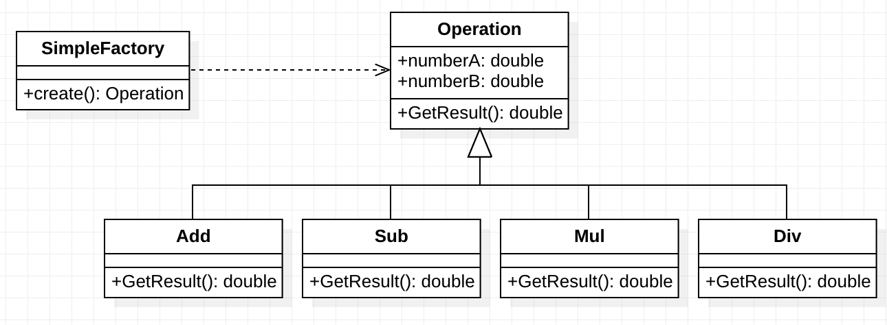

> Simple Factory Pattern 简单工厂模式，属于创建型模式。顾名思义，工厂就是负责制造物品的，在面向对象的世界里，工厂自然就是生产对象、创造对象的。根据参数的不同返回不同类的实例。

### 1. UML图



通过上面的图，我们可以通过 `SimpleFactory` 来生产出四种不同类型的对象。其中，我们将 `Operation` 进行了封装，并且通过虚函数实现了多态，每个子类继承 `Operation` ，实现了 `GetResult` 这个虚函数。

### 2. 应用场景

上面提到过，简单工厂模式属于创建型的模式，也就是说在创建对象的时候，遇到了瓶颈才会选择的设计模式。那么什么时候我们会遇到创建对象的瓶颈呢？当然是我们不知道要创建什么对象的时候，也就是说对象的类型不能在编译期确定，需要等到运行的时候，动态决定应该创建什么类型的对象。这个时候，我们就可以使用简单工厂模式来进行设计。

### 3. 代码

```c++
#ifndef _OPERATION_H_
#define _OPERATION_H_

#include <stdexcept>

class Operation {
public:
    Operation() : _number_a(0), _number_b(0) { };

    ~Operation();

    void set(double a, double b) {
        _number_a = a;
        _number_b = b;
    }

    virtual double GetResult() = 0;

protected:
    double _number_a;
    double _number_b;
};


// Add
class OperationAdd : public Operation {
public:
    double GetResult() {
        return _number_a + _number_b;
    }
};


// Sub
class OperationSub : public Operation {
public:
    double GetResult() {
        return _number_a - _number_b;
    }
};


// Multiplication
class OperationMul : public Operation {
public:
    double GetResult() {
        return _number_a * _number_b;
    }
};


//
class OperationDiv : public Operation {
public:
    double GetResult() {
        if (_number_b == 0) 
            throw std::runtime_error("Math error: Attempted to divide by Zero\n");
        return _number_a / _number_b;
    }
};

#endif  // _OPERATION_H_H
```

```c++
#ifndef _SIMPLE_FACTORY_H_
#define _SIMPLE_FACTORY_H_

#include "operation.h"

class OperationFactory {
public:
    static Operation* CreateOperate(char op) {
        Operation* oper = nullptr;

        if (op == '+') oper = new OperationAdd();
        else if (op == '-') oper = new OperationSub();
        else if (op == '*') oper = new OperationMul();
        else if (op == '/') oper = new OperationDiv();

        return oper;
    }
};

#endif  // _SIMPLE_FACTORY_H_
```

```c++
#include <iostream>
#include "simple_factory.h"

using namespace std;

char rechar() {
    char ch = getchar();
    while (ch == ' ' || ch == '\n' || ch == '\r') ch = getchar();
    return ch;
}

int main() {
    double num_a, num_b;
    char op;
    printf("Please input number a:\n");
    scanf("%lf", &num_a);
    printf("Please select operation (+, -, *, /):\n");
    op = rechar();
    printf("Please input number b:\n");
    scanf("%lf", &num_b);
    
    Operation* oper = OperationFactory::CreateOperate(op);
    oper->set(num_a, num_b);
    try {
        double result = oper->GetResult();
        printf("Result is %lf\n", result);
    }
    catch(const std::runtime_error& e) {
        std::cerr << e.what();
    }
}
```

### 4. 缺点

- 因为工厂类集中了所有的创建逻辑，所以一旦不能正常工作，整个系统都会受影响。
- 只适用于子类不多的情况，如果子类过多就会增加系统的复杂度和理解难度
- 系统扩展困难，因为如果要扩展一个子类，就要修改工厂的判断逻辑，需要重新编译整个系统。