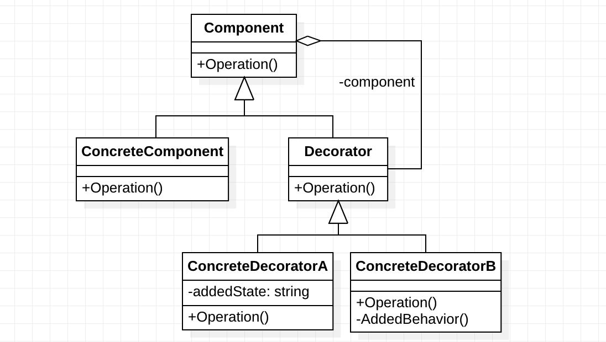
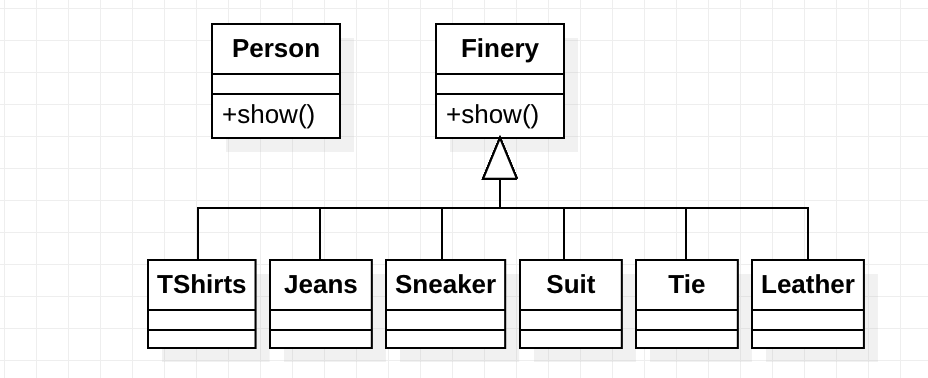

> 装饰模式 (Decorator Pattern) 属于结构型模式，它是作为现有类的一个包装。我们可以在不改变原始类的任何功能，利用装饰类动态地对原始类进行 “装饰” ，即增加新的功能。就增加功能来说，装饰模式比生成子类更为灵活。

<!-- more -->

### 1. UML图



Component 是定义一个对象接口，可以给这些对象动态地添加职责。

ConcreteComponent 是定义了一个具体的对象。

Decorator 装饰抽象类，继承并聚合了 Component，从外类来扩展 Component 类的功能，但是对于 Component 来说并不需要知道 Decorator 的存在。

ConcreteDecorator 就是具体的装饰对象，负责对 Component 进行具体的装饰的功能。 

### 2. 应用场景

假如我们现在需要设计一个QQ秀系统，来进行不同服饰的系统。如果我们进行常规的设计，维护一个 Person 的类，每一个不同的函数进行不同的装饰。

```c++
class Person
{
public:
    Person(string name) : _name(name) {}
    void show() { cout << "装扮的: " << _name << endl; }

    void TShirts() { cout << "T恤 "; }
    void Jeans() { cout << "牛仔裤 "; }
    void Sneaker() { cout << "球鞋 "; }
    void Suit() { cout << "西装 "; }
    void Tie() { cout << "领带 "; }
    void Leather() { cout << "皮鞋 "; }
private:
    string _name;
};
```

当我们需要新增加一种装扮的时候，就要直接修改 Person 这个类，给它增加一个函数来完成相应的功能，这显然不是一种好的方法，违反了 “开放-封闭原则”。

考虑我们之前学习的简单工厂模式和策略模式，很容易想到使用一个服饰的抽象类，通过继承的方式来实现。



```c++
Finery ts = new TShirts();
Finery jeans = new Jeans();
Finery sneaker = new Sneaker();
// ...
ts.show();
jeans.show();
sneaker.show();
```

这样虽然可以满足需要，但是可以看到我们进行了3次 show 的调用，好比我们光着身子，当着大家的面，先穿T恤，再穿牛仔裤，最后穿上鞋子。

所以，我们的目标就是 **<font clor='red'>“把所需的功能按正确的顺序串联起来进行控制”</font>**  。最后调用一次 show 来输出所有信息。

### 3. 代码

```c++
// 抽象基类
class Component
{
public:
    virtual void Operation() = 0;
};
```

```c++
// 具体对象类
class ConcreteComponent
{
public:
    void Operation() { /* ...具体对象的操作 */ }
};
```

```c++
// 装饰类
class Decorator : public Component
{
protected:
    Component* _component;
public:
    Decorator(Component* component) : _component(component) {}
    void Operation()
    {
        if (_component != nullptr)
            _component->Operation();
    }
};
```

```c++
// 装饰类A
class ConcreteDecoratorA : public Decorator
{
private:
    string _addedState; // 本类的独有数据
public:
    void Operation()
    {
        Decorator::Operation();
        // 执行本类的功能
        _addedState = "New State!";   
    }
};
```

```c++
class ConcreteDecoratorB : public Decorator
{
private:
    void AddedBehavior();
public:
    void Operation()
    {
        Decorator::Operation();
        // 执行本类的功能
        AddedBehavior();
    }
};
```

### 4. 优点和缺点

**优点**

- 装饰模式可以动态的添加更多功能的一种方式，而继承模式是静态的扩展功能，因为继承关系是开始时写好的。
- 把每个要装饰的功能放在了单独的类中，并让这个类包装它所要装饰的对象。
- 通过配置文件可以在运行时选择不同的装饰器，从而实现不同的行为。

**缺点**

- 产生很多的小对象，这些对象的区别在于它们之间相互连接的方式有所不同，而不是它们的类或者属性值有所不同，同时还将产生很多具体装饰类。
- 这种比继承更加灵活机动的特性，也同时意味着装饰模式比继承更加易于出错，排错也很困难，对于多次装饰的对象，调试时寻找错误可能需要逐级排查，较为烦琐。