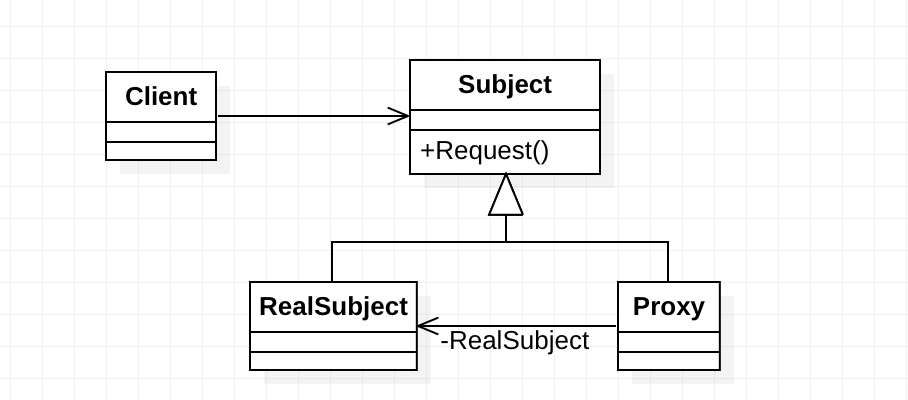

> 代理模式 (Proxy Pettern) 属于结构型模式，为其他对象提供一种代理以控制对这个对象的访问。在某些情况下，一个对象不适合或者不能直接引用另一个对象，而代理对象可以在客户端和目标对象之间起到中介的作用。

<!-- more -->

### 1. UML图



Subject 类是一个共用接口，这样 RealSubject 和 Proxy 就具有相同的基本数据和基本方法，所以任何使用 RealSubject 的地方都可以通过使用 Proxy 代理来完成。

Proxy 中保存一个指向 RealSubject 的指针，这样就可以通过代理来代替实体。

什么时候需要用到代理模式呢？ 

我们回想生活中使用代理的场景，第一个想到的一定是网络代理。我们之所以需要使用网络代理，是因为我们访问某些网站很困难，所以需要代理来完成。另外一个场景比如说我们打官司，需要请一位律师做代理，因为律师比我们更加的专业，我们和法官进行交涉可能会说错话，但是律师不会。

总结一下，我们需要使用代理模式的两个情景：

- 无法直接访问某个对象（无法访问Google）
- 不想直接访问某个对象（不想和法官交流）

### 2. 代码

```c++
class Subject
{
public:
    Subject() {}
    virtual ~Subject() {}
    virtual void Request() = 0;
};
```

```c++
class ConcreteSubject : public Subject
{
public:
    void Request()
    { /* ... */
    }
};
```

```c++
class Proxy : public Subject
{
private:
    Subject* _cs;

public:
    Proxy(Subject* cs) : _cs(cs) {}

    void Request()
    {
        _cs->Request();  // 调用真实的Request
    }
};
```

### 3. 优点和缺点

**优点**

- 代理模式能将代理对象与真正被调用的对象分离，在一定程度上降低了系统的耦合度。
- 代理模式在客户端和目标对象之间起到一个中介作用，这样可以起到保护目标对象的作用。

**缺点**

- 通过代理模式引入了额外的代码，所以带来了额外的开销，访问时间减少。
- 增加了系统的复杂度。如果代理出错，整个系统就会崩溃。