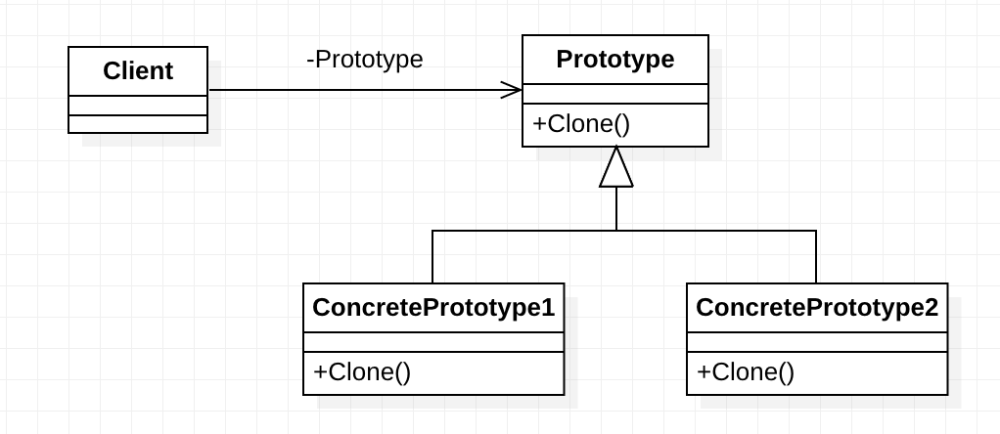

> 原型模式 (Prototype Pattern) 属于创建型模式。它允许一个对象创建另外一个对象，而无需知道任何创建的细节。

<!-- more -->

### 1. UML图



每一个具体的原型类 (ConcretePrototype) 都必须实现 `Clone()` 这个操作。

**为什么要实现一个克隆功能？**

假设我们现在有一个简历类，并且需要20份简历。那么最原始的做法就是我们 `new` 20份简历出来。这样做的缺点在于我们如要想要修改简历，那么20份简历之间是不同步的，每一份都要进行修改。这样的复杂操作显然不是我们想要的结果。

所以，我们希望能够从一个已有的对象创建出另一个对象。其实就是拷贝构造函数的功能。只不过使我们将其封装到了 `Clone()` 操作中。

### 2. 代码

```c++
class Prototype
{
public:
    Prototype() {}
    virtual ~Prototype() {}
    virtual Prototype* Clone() = 0;
    virtual void Display() = 0;
};
```

```c++
class Resume : public Prototype
{
private:
    std::string _name;
    std::string _sex;
    std::string _age;
    std::string _time;
    std::string _company;

public:
    Resume(std::string name) : _name(name), _sex(""), _age(""), _time(""), _company("") {}

    // 拷贝构造函数
    Resume(const Resume& other)
    {
        _name = other._name;
        _sex = other._sex;
        _age = other._age;
        _time = other._time;
        _company = other._company;
    }
    
    ~Resume() {}

    void SetPersonalInfo(std::string sex, std::string age)
    {
        _sex = sex;
        _age = age;
    }

    void SetWorkExperience(std::string time, std::string company)
    {
        _time = time;
        _company = company;
    }

    void Display()
    {
        std::cout << _name << " " << _age << "  " << _sex << std::endl;
        std::cout << _time << " " << _company << std::endl;
        std::cout << std::endl;
    }

    Resume* Clone()
    {
        return new Resume(*this);
    }

};
```

```c++
int main()
{
    Resume *a = new Resume("Xiaoming");
    a->SetPersonalInfo("male", "23");
    a->SetWorkExperience("2018-2019", "ByteDance");
    
    Resume *b = a->Clone();
    b->SetWorkExperience("2019-2020", "Microsoft");

    Resume *c = a->Clone();
    c->SetWorkExperience("2020-2021", "Hulu");

    a->Display();
    b->Display();
    c->Display();

    return 0;
}
```

### 3. 浅拷贝与深拷贝

上面我们的数据类型都是 `string` 类型的，也就是 **值类型** 。如果我们的数据类型是一个指针或者引用，事情就不一样了。举个简单的例子：

```c++
int *p = new int(52);
int *q = p;
```

`p` 和 `q` 拷贝的只是地址，在深一层的数值52并没有被拷贝。我们称这种拷贝为**浅拷贝**。

> 浅拷贝：对字段进行逐位复制，如果字段是引用或者指针。则只能复制引用或指针，不能复制引用的对象或指向的对象。

所以，我们要手动实现**深拷贝**。

### 3. 优点和缺点

**优点**

- 如果创建新的对象比较复杂，可以利用原型模式简化对象的创建过程，同时也能够提高效率。
- 简化对象的创建，无需理会创建过程。
- 可以在程序运行时（对象属性发生了变化）获得一份内容相同的实例，他们之间不会相互干扰。

**缺点**

- 在实现深拷贝时可能需要比较复杂的代码
- 需要为每一个类配备一个克隆方法，而且该克隆方法需要对类的功能进行通盘考虑，这对全新的类来说不是很难，但对已有的类进行改造时，不一定是件容易的事，必须修改其源代码，违背了“开闭原则”。