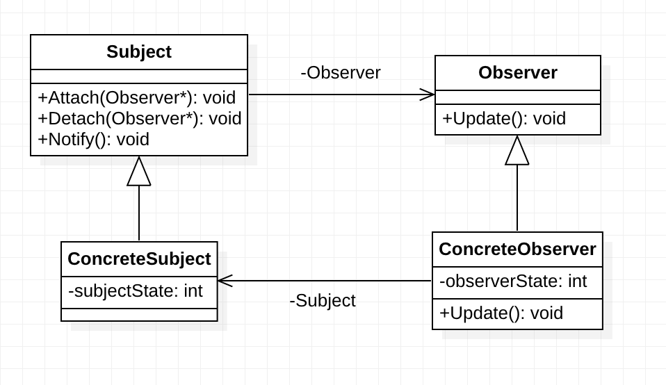

> 观察者模式 (Observer Pattern) 又叫做发布-订阅模式。它定义了一种一对多的依赖关系，让多个观察者对象同时监听某一个主题对象。这个主题对象在状态发生变化时，会通知所有观察者对象，使它们能够自动更新自己。

<!-- more -->

### 1. UML图



**Subject 抽象主题**，一般用一个抽象类或者一个接口实现。它把所有对观察者对象的引用保存在一个聚集里，每个主题都可以有任何数量的观察者。提供两个接口：`Attach` 增加观察者对象；`Detach` 删除观察者对象。

**Observer 抽象观察者**，为所有的具体观察者定义一个接口，在得到主题的通知时更新自己。这个接口叫做更新接口。

**ConcreteSubject 具体主题**，当具体主题的内部状态改变时，给所有登记过的观察者发出通知。

**ConcreteObserver 具体观察者**，实现抽象观察者要求的更新接口，以便使本身的状态与主题的状态相协调。

***

**用观察者模式的动机是什么？**

将一个系统分割成一系列相互协作的类有一个很不好的副作用，那就是需要维护相关对象之间的一致性。我们不希望为了维持一致性而使各类紧密耦合，这样会给维护、扩展和重用都带来不便。

观察者模式的关键对象是主题 Subject 和观察者 Observer，一个 Subject 可以有任意个依赖它的 Observer，一旦 Subject 的状态发生了改变，所有的 Observer 都可以得到通知。Subject 发出通知时并不需要知道谁是它的观察者，也就是说，具体观察者是谁，它根本不需要知道。而任何一个具体观察者不知道也不需要知道其他观察者的存在。

**什么场景需要使用？**

当一个对象的改变需要同时改变其他对象的时候。观察者模式所做的工作其实就是在解除耦合。让耦合的双方都依赖于对象，而不是依赖于具体。从而使得各自的变化都不会影响另一边的变化。

### 2. 代码

```c++
class IObserver;

// 抽象主题
class ISubject
{
public:
    virtual void Attach(IObserver *) = 0;  // 注册观察者
    virtual void Detach(IObserver *) = 0;  // 注销观察者
    virtual void Notify() = 0;  // 通知观察者
};
```

```c++
// 抽象观察者
class IObserver
{
public:
    virtual void Update(float price) = 0;  // 更新价格
};
```

```c++
// 具体主题
class ConcreteSubject : public ISubject
{
private:
    list<IObserver*> _observers;
    float _price;
public:
    ConcreteSubject() : _price(10) {}

    void SetPrice(float p) { _price = p; }

    // 增加一个观察者
    void Attach(IObserver *observer)
    {
        _observers.push_back(observer);
    }

    // 移除一个观察者
    void Detach(IObserver *observer)
    {
        _observers.remove(observer);
    }

    // 通知所有观察者
    void Notify()
    {
        for (auto it = _observers.begin(); it != _observers.end(); ++it)
            (*it)->Update(_price);
    }
};
```

```c++
class ConcreteObserver : public IObserver
{
private:
    string _name;
public:
    ConcreteObserver(string name) : _name(name) {}

    void Update(float price)
    {
        cout << _name << " price: " << price << endl;
    }
};
```

```c++
int main()
{
    // 创建主题、观察者
    ConcreteSubject *pSubject = new ConcreteSubject();
    IObserver *pObserver1 = new ConcreteObserver("Jack Ma");
    IObserver *pObserver2 = new ConcreteObserver("Pony");
    IObserver *pObserver3 = new ConcreteObserver("Yansong Li");

    // 注册观察者
    pSubject->Attach(pObserver1);
    pSubject->Attach(pObserver2);
    pSubject->Attach(pObserver3);

    // 更改价格，通知观察者
    pSubject->SetPrice(12.5);
    pSubject->Notify();
    cout << "===========================" << endl;

    // 注销观察者
    pSubject->Detach(pObserver3);

    // 更加价格，通知观察者
    pSubject->SetPrice(15.0);
    pSubject->Notify();

    return 0;
}
```

```shell
Jack Ma price: 12.5
Pony price: 12.5
Yansong Li price: 12.5
===========================
Jack Ma price: 15
Pony price: 15
```

### 3. 优缺点

**优点**

- 观察者和被观察者是抽象耦合的
- 建立一套触发机制

**缺点**

- 如果一个被观察者对象有很多的直接和间接的观察者，将所有的观察者都通知到会花费很多时间。
- 如果在观察者和观察目标之间有循环依赖的话，观察目标会触发它们之间进行循环调用，可能导致系统崩溃。
- 观察者模式没有相应的机制让观察者知道所观察的目标对象是怎么发生变化的，而仅仅只是知道观察目标发生了变化。